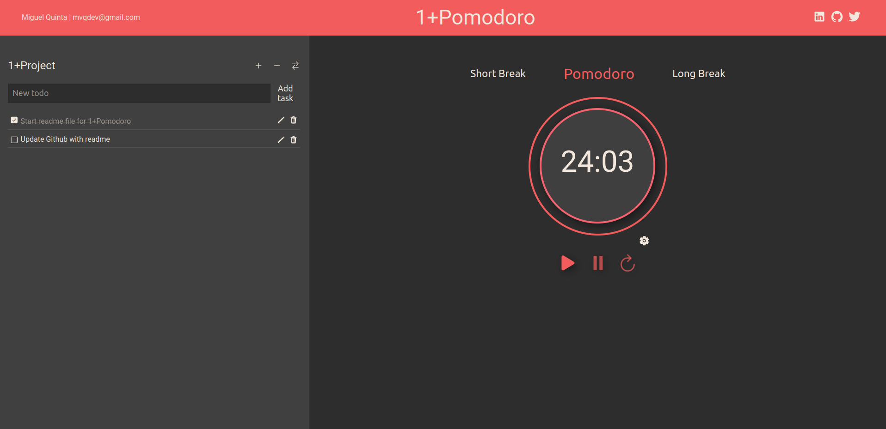

# 1+Pomodoro
> Web Browser application to manage your Pomodoro times with an associated Todo List to help you stay focus and motivated.
> Live demo [_here_](https://onemorepomodoro.netlify.app/).

## Table of Contents
* [General Info](#general-information)
* [Technologies Used](#technologies-used)
* [Features](#features)
* [Screenshots](#screenshots)
* [Contributions](#contributions)
* [Project Status](#project-status)
* [Acknowledgements](#acknowledgements)
* [Contact](#contact)
* [License](#license)

## General Information
I started using the pomodoro technique when I started learning how to code. This technique suited me perfectly to keep me productive and motivated and when thinking on what should be my first portfolio project, 1+Pomodoro came to my mind. 

Merged with a Todo List, this project shows my understanding of the frontend development foundations. 

## Technologies Used
- React
- JavaScript, HTML, CSS
- Framer Motion
- React Icons

## Features
- Pomodoro Clock Timer - Three different sessions (Pomodoro, Short Break, Long Break) that allow edition.
- Todo List - Add Task, Edit Task, Add Project and Switch Project.
- Responsive.

## Screenshots

## Contributions
If you would like to contribute that would be awesome!
Just clone the project and install dependencies

`git clone git@github.com:mvquinta/1-pomodoro.git`
`npm install`

## Project Status
Project is: _in progress_ 

Issues:
- "Time is Nan". While editing times, when inserted letters instead of only numbers we get NaN on the clock. Note: maybe use isNan() to filter form input
- Sometimes edit task does not work. It's a bug that I'm not being able to reproduce constantly. I believe it haves something to do on how I'm dealing with state.

To do:
- Animate exterior circle. It should have an progress animation that will fill the path circle from 0 to 100% as session time goes by.

Room for improvement:
- Account creation and Log In feature to save state of Pomodoro and Todolist. (At this moment I'm using localStorage)

## Acknowledgements
- To [James](https://github.com/jrobind) for guidance, teaching and motivation
- Thank you [ritaly](https://github.com/ritaly) for this Readme template markdown

## Contact
- mvqdev@gmail.com
- https://github.com/mvquinta
- https://twitter.com/mvqdev1

## License
This project is open source and available under the [MIT License](https://github.com/mvquinta/1-pomodoro/blob/main/LICENSE.md).
